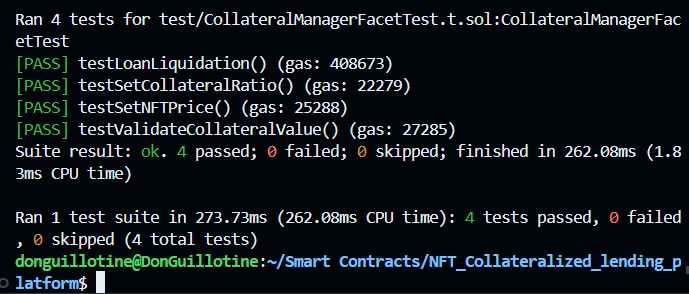

# NFT Collateralized Lending Platform - Diamond Standard Implementation

A decentralized NFT-collateralized lending platform implemented using the Diamond Pattern (EIP-2535). This platform enables users to deposit NFTs as collateral to borrow ETH, with fixed-term loans and interest rates.


## Overview

This platform provides a secure and efficient way to use NFTs as collateral for ETH loans. Built using the Diamond Pattern, it offers modular functionality and upgradeability while maintaining high security standards.

### Key Features

- NFT collateralization
- Fixed-term loans
- Configurable interest rates
- Automated liquidation process
- Whitelisted NFT collections
- Emergency pause functionality
- Platform fee management
- Treasury management

## Architecture

The platform is built using the Diamond Pattern (EIP-2535) and consists of the following main components:

### Facets

1. **NFT Management Facet**
   - NFT deposits and withdrawals
   - Ownership tracking
   - Collection management

2. **Lending Facet**
   - Loan creation and management
   - Interest calculation
   - Repayment processing
   - Default handling

3. **Collateral Manager Facet**
   - Price feed management
   - Collateral ratio enforcement
   - Liquidation process
   - Value calculations

4. **Treasury Facet**
   - ETH deposits and withdrawals
   - Platform fee collection
   - Revenue distribution
   - Balance tracking

5. **Admin Facet**
   - Platform parameter management
   - Emergency controls
   - Collection whitelisting
   - Fee configuration

### Libraries

- `LibStorage.sol`: Central storage management
- `LibNFTLending.sol`: Core lending logic
- `LibSecurity.sol`: Security and access control

## Technical Specifications

- Solidity version: ^0.8.0
- Framework: Foundry
- Pattern: Diamond Standard (EIP-2535)

## Key Design Patterns Used

- Diamond Pattern (EIP-2535)
- Facet Pattern
- Storage Pattern
- Access Control Pattern
- Emergency Stop Pattern
- Event-Emission Pattern
- Guard Pattern

## Installation

1. Clone the repository:
```bash
git clone https://github.com/DonGuillotine/NFT-Collateralized-lending-platform.git
cd NFT-Collateralized-lending-platform
```

2. Install dependencies:
```bash
forge install
```

3. Compile contracts:
```bash
forge build
```

4. Run tests:
```bash
forge test
```

## Usage

### Deploying the Platform

1. Deploy the Diamond contract:
```bash
forge script scripts/deploy.s.sol:DeployScript --rpc-url <your_rpc_url> --private-key <your_private_key>
```

2. Initialize the platform with default parameters:
```bash
forge script scripts/initialize.s.sol:InitializeScript --rpc-url <your_rpc_url> --private-key <your_private_key>
```

### For Borrowers

1. Deposit NFT:
```solidity
INFTManagement(diamondAddress).depositNFT(collection, tokenId);
```

2. Create loan:
```solidity
ILending(diamondAddress).createLoan(collection, tokenId, amount);
```

3. Repay loan:
```solidity
ILending(diamondAddress).repayLoan(loanId);
```

### For Lenders

1. Deposit ETH:
```solidity
ITreasury(diamondAddress).depositETH{value: amount}();
```

2. Withdraw ETH:
```solidity
ITreasury(diamondAddress).withdrawETH(amount);
```

## Testing

The platform includes comprehensive tests for all components:

```bash
# Run all tests
forge test

# Run specific test file
forge test --match-path test/LendingFacetTest.t.sol

# Run tests with gas reporting
forge test --gas-report
```

### All Tests Passed for `NFTManagementFacet`


### All Tests Passed for `CollateralManagerFacet`



### All Tests Passed for `LendingFacet`


### All Tests Passed for `TreasuryFacet`


### All Tests Passed for `AdminFacet`


## Security Considerations

- All functions include proper access control
- Reentrancy protection on ETH transfers
- Parameter validation and bounds checking
- Emergency pause functionality
- Secure NFT handling
- Protected admin functions

## Platform Parameters

Default parameters (configurable by admin):
- Interest Rate: 10% (1000)
- Collateral Ratio: 150% (15000)
- Loan Duration: 7 days
- Platform Fee: 1% (100)
- Minimum Deposit: 0.1 ETH

## Future Improvements

- Multi-token support
- Variable interest rates
- NFT basket loans
- Secondary market for loans
- Integration with NFT price oracles
- Enhanced liquidation mechanisms
- Governance implementation

## Contributing

1. Fork the repository
2. Create your feature branch
3. Commit your changes
4. Push to the branch
5. Create a new Pull Request

## License

This project is licensed under the MIT License - see the [LICENSE](LICENSE) file for details.

## Acknowledgments

- Based on the [Foundry-Hardhat-Diamonds](https://github.com/Timidan/Foundry-Hardhat-Diamonds) template
- Implements [EIP-2535 Diamond Standard](https://eips.ethereum.org/EIPS/eip-2535)

## Support

For support, please open an issue in the repository or contact the development team.

## Disclaimer

This software is provided "as is", without warranty of any kind. Use at your own risk.
